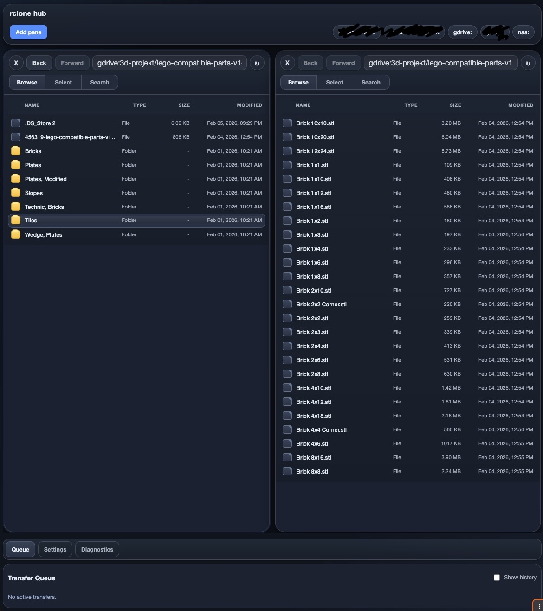

# rclone-hub

Mac-first, cross-platform local web UI for rclone remotes with multi-pane navigation and safe transfers.



## Structure

- `/backend`: FastAPI API + transfer engine + sqlite persistence.
- `/frontend`: React/Vite multi-pane UI.
- `/docs`: architecture and safety docs.

## One-command dev run

Run backend + frontend together:

```bash
cd /path/to/rclone-hub
./scripts/dev.sh
```

What it does:
- Creates backend virtualenv if missing.
- Installs backend/frontend deps if missing.
- Auto-picks free ports if default `8000` or `5173` are already in use.
- Wires frontend to the chosen backend API automatically.

Optional overrides:

```bash
BACKEND_PORT=8100 FRONTEND_PORT=5174 ./scripts/dev.sh
```

Or configure defaults in a root `.env` file:

```bash
cp .env.example .env
```

Then edit:

```env
BACKEND_PORT=8100
FRONTEND_PORT=5174
```

When ports are set in `.env`, `./scripts/dev.sh` treats them as fixed and exits with a clear error if they are already in use.

## Backend quickstart

```bash
cd /path/to/rclone-hub/backend
python -m venv .venv
source .venv/bin/activate
pip install -e .[dev]
uvicorn app.main:app --host 127.0.0.1 --port 8000 --reload
```

## Frontend quickstart

```bash
cd /path/to/rclone-hub/frontend
npm install
npm run dev
```

Then open `http://127.0.0.1:5173`.
