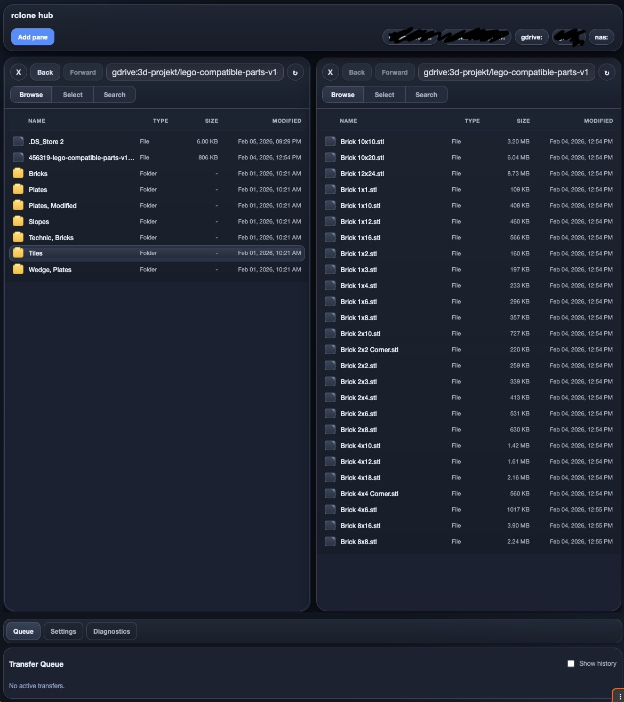

# rclone-hub

Manage your `rclone` remotes from a clean local desktop app built for browsing and moving files confidently.

rclone-hub gives you a visual, multi-pane workspace for exploring remotes, searching across directories, and running transfers without living in terminal commands all day.



## Features

- Multi-pane navigation for side-by-side browsing across remotes.
- Built-in search with live progress so you can quickly find files across large remote trees.
- Right-click folder size calculation with live progress, cancel support, and per-pane cached results shown in the Size column.
- Transfer-focused workflow designed to make file moves clear and predictable.
- In-app preview for remote `jpg`/`jpeg`/`png`/`gif` files with an indeterminate loading bar and optional download action.
- Local-first Electron app that runs on your machine.
- Cross-platform desktop packaging with Electron.
- Built around `rclone` remotes so you can keep using the storage you already have.

## Quick Start

Clone or open this repo, then run:

```bash
git clone https://github.com/andreas-io/rclone-hub.git
cd rclone-hub
npm install
npm run electron:dev
```

That starts the Vite renderer, watches the Electron TypeScript code, and launches the desktop app.

For a production build:

```bash
npm run build
```

For packaged desktop binaries:

```bash
npm run dist
```

The app still requires `rclone` to be installed and available on your `PATH`.

## Who It's For

- People who manage files across multiple cloud or network remotes with `rclone`.
- Users who want a visual workflow instead of a command-heavy routine.
- Anyone who needs faster side-by-side file operations across storage backends.

## Documentation

- `docs/architecture.md` for system design details.
- `docs/transfer-safety.md` for transfer behavior and safety notes.
- `docs/api.md` for the Electron IPC surface and renderer contract.

## Current Status

This is an active work in progress. Core workflows are usable, and the product is continuing to evolve based on real usage and feedback.
